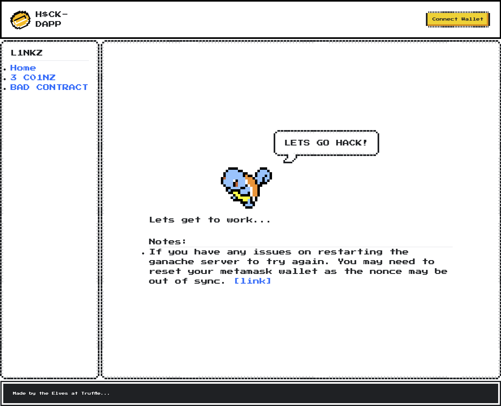
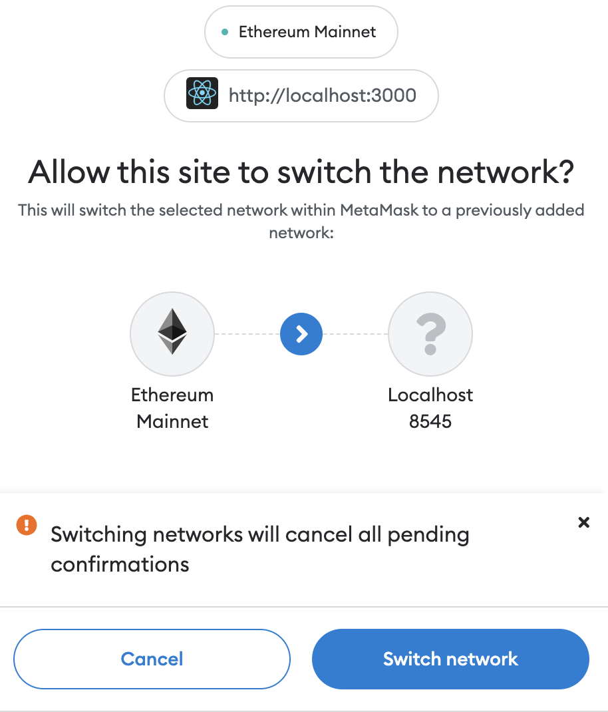
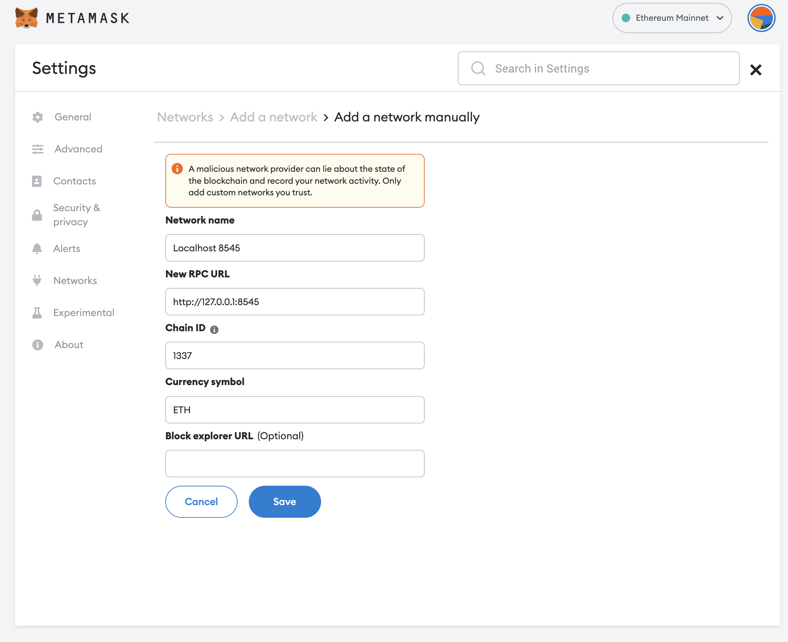
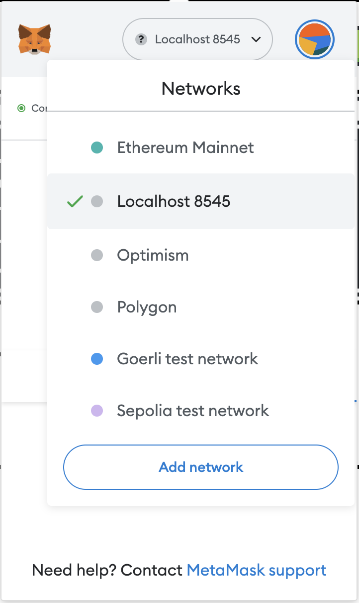
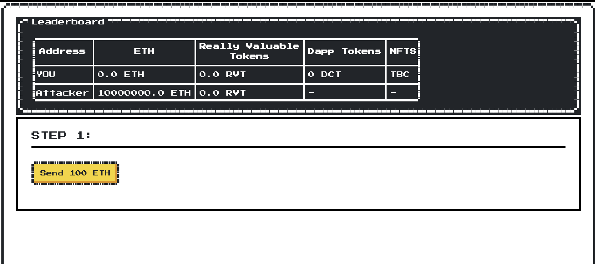
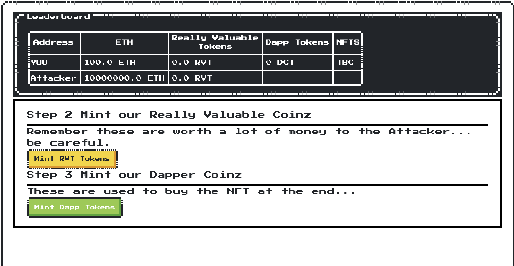
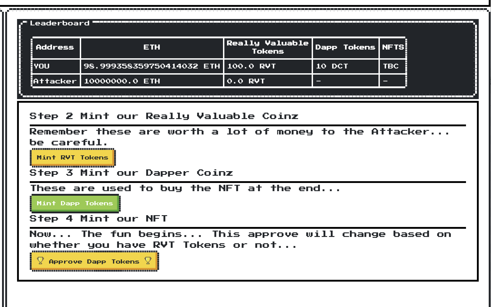
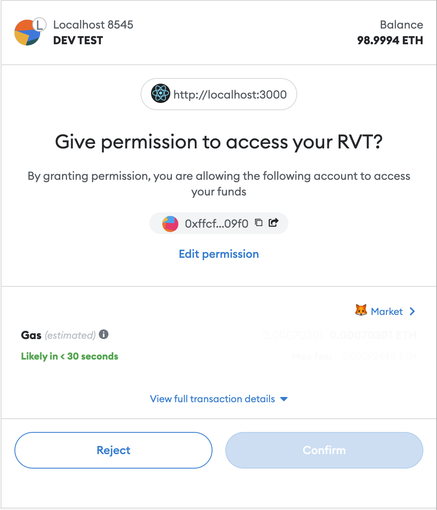
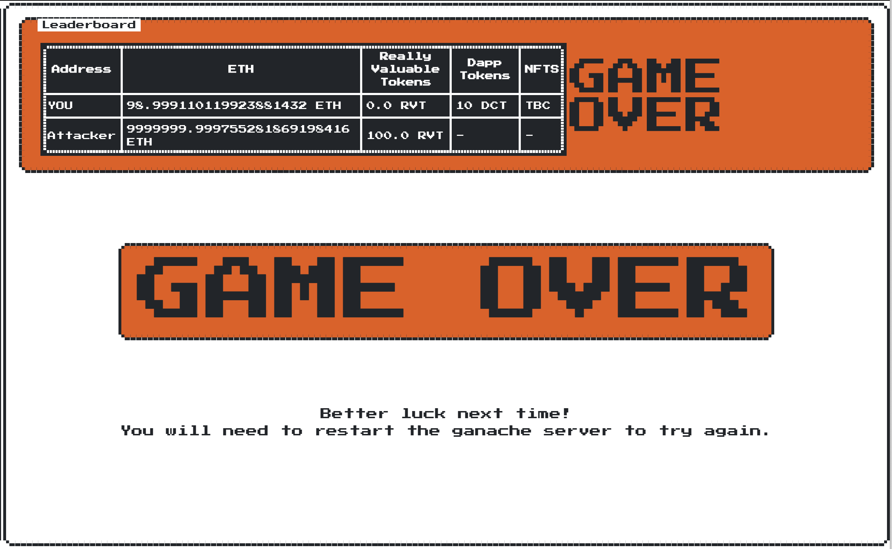

# HACKD-DAPP

This is a small react website we can use to show a bunch of hacks or website/visual UI's for cool little examples.

Initially we have an example called `3 C01NZ` which is an emulation of the BadgerDAO hack to let you see what happens when things go wrong on your DAPP doing bad things. This is a learning tool and is to explain how bad things happen in this space and how to avoid them when developing or using DAPPs. It's not meant to be a template on how to make your own hack and steal peoples money.

## Running

Goto the `hack-dapp` folder and run this in the terminal:

```shell
packages/hackd-dapp
> yarn run-hackdapp
```

This will set up an instance of ganache and run the hackdapp server, after a shortwhile when everything is loaded you can log in to the website and start.

Once your in the website you want to connect your wallet and connect to the localhost ganache server as this is where we will be doing all our testing.

The reason we do it like this so we can have a cleanroom setting to do our hack and you are safe knowing this isn't happening on a testnet and something bad could happen.

You can then open the gui and play around with the speedrun.

### How To Play

In this example we have a dapp frontend that will behave 'differently' based on the contents of your EOA on the local blockchain.

1. If you have no ReallyValuableTokens in your account then when you approve to be able to buy the NFT it will send the correct approval to allow the contract to use your `DappCoinToken` balance to buy one.
2. If you do have ReallyValuableTokens in your account then the hackers code will change the approve call to approve them so it can then drain your funds... Fun eh?

#### Scenario 1 - You only have DappCoinTokens

To set up this scenario click the button to get FreeDappTokens, this will mint you 100 tokens so plenty to be able to buy some cool NFTs from here right?

Then you can go buy the NFT by clicking the BUY NFTs button. This will do 2 things:

1. Check it has approval on DappCoinTokens to make the purchase. If not, it will do the approval call first.
2. If it has the approval for your Token spend then it will let you buy an NFT.

#### Scenario 2 - You have DappCoinTokens & ReallyValuableTokensx

To set up this scenario click the button to get FreeDappTokens, this will mint you 100 tokens so plenty to be able to buy some cool NFTs from here right? Then click button to get some ReallyValuableTokens too. You will get 100 of them too. Don't go customising your lambo just yet though...

Then you can go buy the NFT by clicking the BUY NFTs button. This will do 2 things:

1. Check your balance of ReallyValuableTokens... If you have some it will change the approvals and encode that one instead of DappCoinToken.
2. When you approve this, well, game over.
3. Now it has approval, strangely you can't buy any NFTs...
4. At the top of the screen you will see the P0WN3D section changing to show the attacker now has approval on your coins and would most likely drain them.

## The steps

Here we outline how to get started with this tutorial/hack. Getting Metamask to connect to our local network can take a few steps but once its done you will probably want to reuse it when you start developling locally on other projects.

1. Open the browser at the hack-dapp url:

You will see the welcome page.



Let's click on the connect wallet option. We are using [Metamask](https://metamask.io) for this tutorial. It works really well with localhost testing and developement so please give it a try if you aren't using it already.

### Setup a localhost network

Once you have connected your wallet on mainnet or somewhere else the UI will ask you if you want to switch networks to Localhost.



Clicking on the switch networks will switch the network. Although sometimes it might not switch it correctly. I'm not sure why but here is how to fix it.

Add a new network in Metamask by following this tutorial:  

[Adding a network manually](https://metamask.zendesk.com/hc/en-us/articles/360043227612-How-to-add-a-custom-network-RPC#h_01G63GGJ83DGDRCS2ZWXM37CV5)



When you are adding in the details use these:

```text
Network Name:
Localhost - 8545

New RPC URL:
http://127.0.0.1:8545

Chain ID:
1337

Currency Symbol: 
ETH

```

Then click **Save** button.

At this point you will now be connecting to your localhost server you ran earlier. If not you can change it in the network tab at the top.



## OK, Lets Begin

When we begin we goto the `3 C01NZ` page on the left hand menu.

At the top of the screen, we can see the leaderboard, YOU (your current wallet address) and the Attacker.



So you have 0 ETH at the beginning.

## Get Some ETH

So lets do **Step 1** first. Click the button and in a few moments you should have some money added to your account so you can have some pocket money to do some trades. _(Unfortunately this is test eth so don't go shopping for a BAYC after clicking the button.)_



## Mint yourself some Coinz

You can opt to do Step 2 and mint yourself some **Really Valuable Coinz** which are for our purposes here akin to Wrapped Ethereum or something similar. You wouldn't want to lose these.

And also lets do Step 3 and mint some **Dapper Coinz** these are what we need to use to buy our NFT eventually and are pretty cheap and probably not worth anywhere like the **RVT** above.



## Lets Mint our NFT... 

So now as we have some DCT (Dapper Coinz) the site will let us now approve tokens so our contract for the NFT can then transfer tokens on your behalf (up to a limit hopefully) to allow it to then make a purchase/trade of DCT for an NFT.

Metamask will pop up and now (thankfully we have a really nice warning/confirmation)...



Hold on a minute, weren't you supposed to approve DCT? At this point its up to you to confirm this...

## If you confirmed...



Yeah that was a bad idea. The hacker was watching for an approve to its account from the RVT account from anyone and then as soon as that happened it drained your account, pretty cool eh? Well if this was IRL it would be not so cool.

## If you said, damn, no way jose

Congrats you just saved yourself from being hacked

## The anatomy of the hack

So what happens here is we have bad code on our server changing the code depending on whether the user of the site fitted some criteria that made them a target.

In BadgerDAO's case, they were doing some funky things in their cloudflare web hosting infra that allowed hackers to silently inject code that did the same as our little hack but in a way that was transparent to the coders at BadgerDAO (They rewrote the linked/compiled libraries for the Web3 components) and didn't actually adjust any site code. So when you thought you were doing an approve for their badger tokens you were actually approving a bunch of other high value ERC20's the hackers had found on your account.

We do something similar with the callback we create for the approve button:

```typescript
// FROM src/pages/Mint.tsx

const approveDT = useCallback(() => {
    console.log("approveDT", {myRvtBalance, myDTBalance});    
    if (myRvtBalance?.value && myRvtBalance.value.gt(0)) {
             console.log(`approveDT: hacked approve `, {myRvtBalance, myDTBalance})
        rvTokenInst?.approve(accounts.attacker, myRvtBalance!.value, {from: address})
          .then((_) => {
            // MUAHAHAHAHAH - lets use that approve shall we? the listener we have setup in the hacker hook does this...
          }, (reason) => {
            console.error(reason)
          })
    } else {
      // normal version
        console.log(`approveDT: normal one. `, {myRvtBalance, myDTBalance})
        // we only need 1 RVT
        rvTokenInst?.approve(contracts.dappCoinToken, parseEther("1"), {from: address})
          .then((_) => {
            // sadly this is just the normal approve.. booo.
          }, (reason) => {
            console.error(reason)
          })
    }
  }, [myRvtBalance])
```

And then to mimic the server that the hackers had setup looking for hacked approvals we create a hook that sits in the back of the page to do that:

`src/hooks/useHackDapp.ts`

```typescript
/**
 * This hook would emulate what the hackers server was doing in the background somewhere monitoring the blockchain
 * for approval events to its account so it could instantly drain them.
 */
export function useHackerMonitor() {
  const [hacked, setHacked] = useState(false);
  const provider = useProvider({chainId: chainId.localhost})

  const wallet = new ethers.Wallet(testAccountPrivateKeys.attacker);
  const walletSigner = wallet.connect(provider);
  const rvtInst = ReallyValuableToken__factory.connect(contracts.reallyValuableToken, walletSigner)

  const {data: attackerEthBalance} = useBalance(
    {
      address: accounts.attacker,
      chainId: localhost.id,
      formatUnits: "ether",
      watch: true,
    })

  const {data: attackerRvtBalance} = useBalance(
    {
      address: accounts.attacker,
      token: contracts.reallyValuableToken,
      chainId: localhost.id,
      formatUnits: "ether",
      watch: true,
    })

  useEffect(() => {
    setHacked(attackerRvtBalance !== undefined && attackerRvtBalance.value.gt(0))
  }, [attackerRvtBalance])

  // keep an eye on the approvals and if we get an approval with our address in it and we have some allowance then take it.
  useContractEvent({
    address: contracts.reallyValuableToken,
    abi: rvtAbi,
    eventName: "Approval",
    async listener(owner: string, spender: string, amount: BigNumber) {
      // Approval(owner, spender, amount)
      console.log(`Approve Listener: `, {myAddress: accounts.attacker, owner, spender, amount})
      if (accounts.attacker === spender) {
        const allowance = await rvtInst.allowance(owner, accounts.attacker)
        if(!allowance.isZero()){
          console.log(`We have been approved: lets go`, {amount: amount.toString(), allowance: allowance.toString()})
          rvtInst.transferFrom(owner, accounts.attacker, allowance)
            .then(value => alert(value), reason => alert(reason))
        }
      }

    },
  })

  return {hacked, attackerEthBalance, attackerRvtBalance}
}
```

The most important bit is the `useContractEvent` hook at the bottom which sits in the background and acts accordingly. Any approvals that come in to the `attacker` that have some allowance are instantly drained.

## How can I stop this happening to my DAPP?

Well the easiest way would be to not do anything so complex as rewriting your server code in Cloudflare as part of your general process. The chance for supply chain or any kind of hack increases the more magic you add into your process. Also having tighter DevOp and SecOps practices. Not blindly approving API keys and keeping stricter logging and controls on your infrastructure would have helped but unfortunately a lot of people running these projects don't really bother with this until its too late, as we saw here.

## Conclusion

If you want to run this again you need to restart the blockchain server and you may also need to reset the nonce in your wallet so transactions will work again. [Reset Your Account](href="https://metamask.zendesk.com/hc/en-us/articles/360015488891-How-to-reset-an-account") has all the details .

## Credits

- https://nostalgic-css.github.io/NES.css/
- ethers
- wagmi
- stackoverflow
- yarn 3
- coffee
